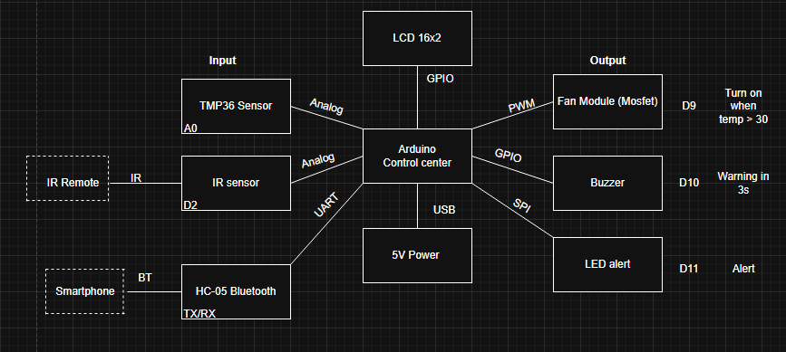
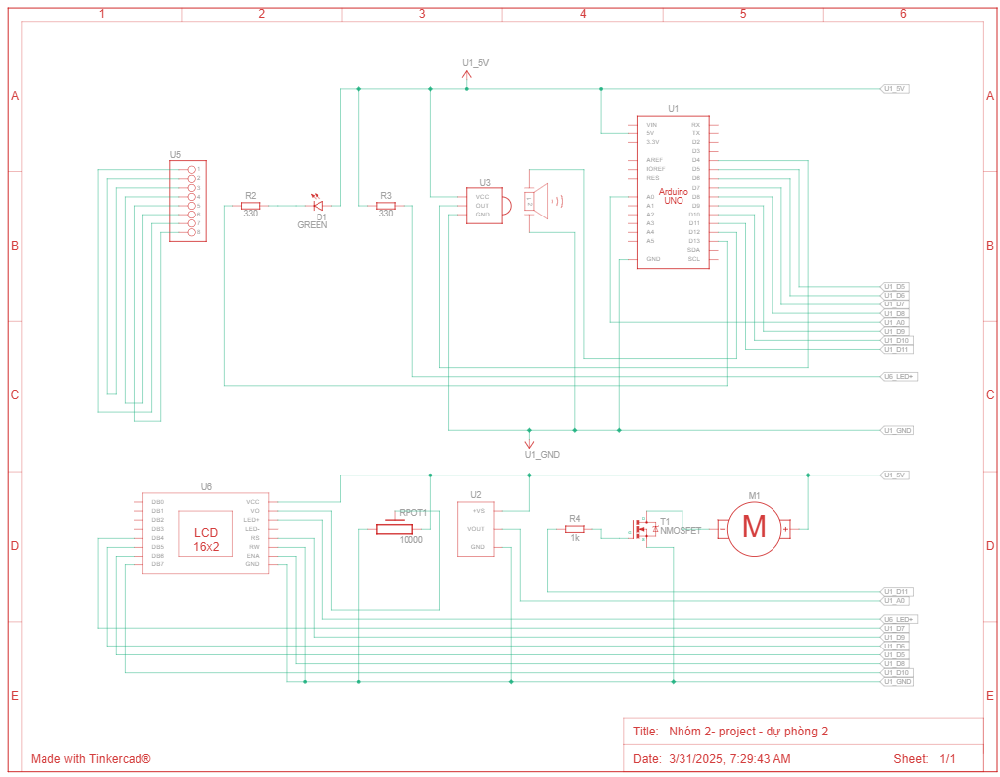
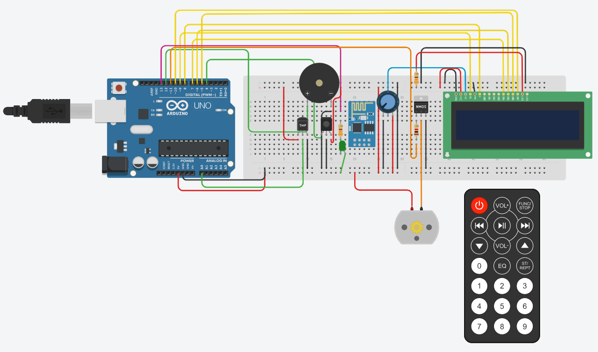
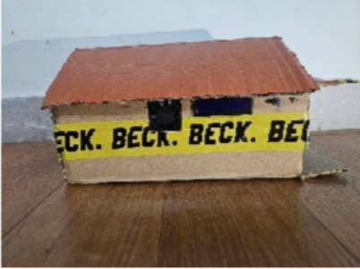
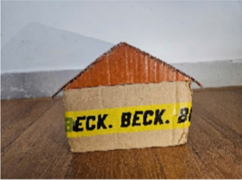
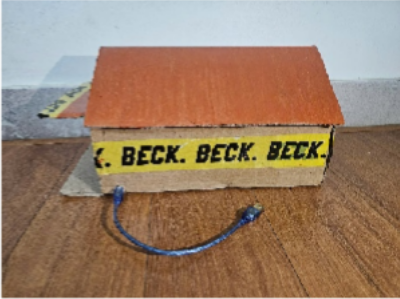
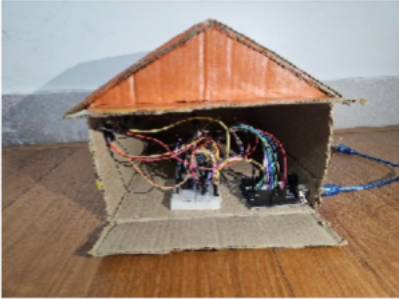

# Medicine Storage Temperature Tracker

## I. Project Idea
**1. Project Idea**
- A monitoring and control system for the warehouse environment to ensure that medicines and pharmaceuticals are always stored at safe temperature conditions. The system uses a temperature sensor to measure the environment's temperature in the warehouse and allows the control of devices such as lights, alarms, and fans through remote control and mobile phone apps.
- When the temperature exceeds the allowed limit, the system will:
  - Automatically alert with warning lights and alarms.
  - Automatically turn on the fan to cool down the warehouse.

**2. System Requirements**
- Hardware Requirements
  - Temperature sensor
  - Microcontroller (Arduino)
  - Bluetooth module for mobile phone connection
  - Display screen
  - Sound alarm
  - Warning lights
  - Cooling system
  - IR sensor to receive signals from the remote control
  - Resistors, potentiometer, transistors

**3. System Functions**
- Read temperature data from the LM35 sensor and send it to Arduino.
- Display temperature on the LCD 16x2, and the mobile app to monitor directly.
- Transmit data to the Serial Monitor for checking on the computer.
- Alert when the temperature exceeds the limit:
  - When the temperature ≥ 30°C:
    - Turn on the fan using the Fan Module (Mosfet).
    - Turn on the warning LED to signal high temperature.
    - Emit a sound alert with the buzzer for 3 seconds.
  - The system can be controlled remotely via IR Remote or Smartphone (Bluetooth) to turn off the alarm.
- Cooling System Control (optional)
  - Use the Smartphone connected to the HC-05 Bluetooth to:
    - Turn on/off the fan manually if needed.
    - Turn off the alarm if the warning has been acknowledged.

## II. Content
**1. Components (Hardware Required)**
- Arduino Uno R3
- 5V Fan
- Temperature Sensor [LM35]
- Piezo Buzzer
- Red LED
- IR Sensor
- Bluetooth Module HC-05
- 10k Ω Potentiometer
- LCD 16x2
- Transistor
- 330 Ω Resistor
- 1 kΩ Resistor

**2. Functional Block Diagram**

**3. Schematic Diagram**

**4. Circuit Diagram**

**5. Flowchart**

**6. Interface Design**

## III. Results Achieved
- The system has successfully completed the basic functions of monitoring and controlling the warehouse environment:
  - Continuously reads and monitors the temperature in the warehouse.
  - Provides visual alerts with LEDs and alarms when the temperature exceeds the limit.
  - Automatically controls the cooling fan when high temperature is detected.
  - Turns off the warning systems when the temperature returns to a safe level.
  - Integrates manual control for devices (fan, alarm, light) via buttons and a mobile phone app.
  - Communicates through the Serial port to check the temperature and device status directly.
  - The system ensures the goal of demonstrating, in a clear and understandable way, how to monitor and protect the pharmaceutical warehouse in real life.
